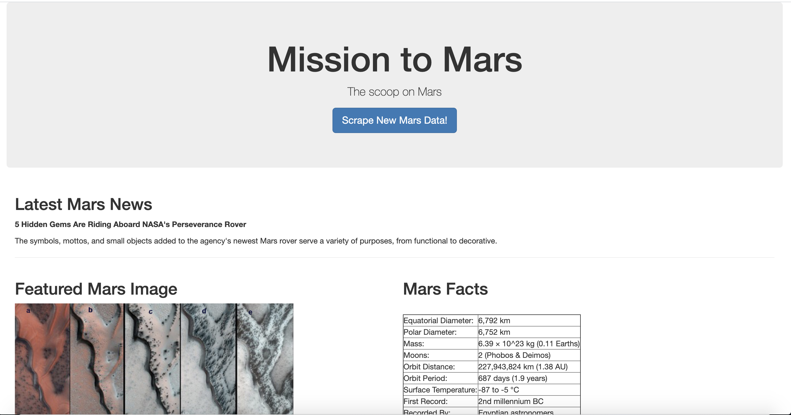
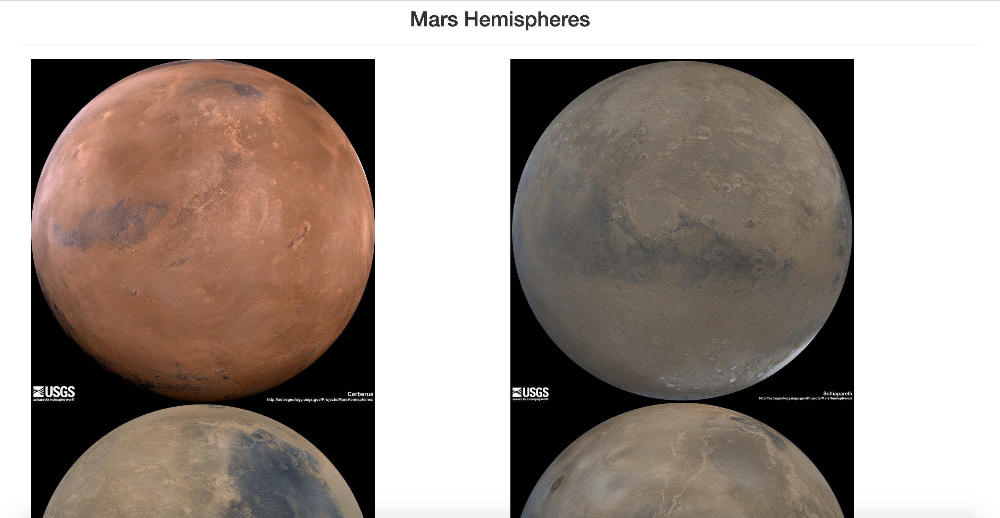

# Mission to Mars

## Project Summary

* The end goal of this project was to deliver a web application that would scrape the latest Mars news, data, and photos.
* These were the steps taken to achieve this goal:
  * Web Scraping
  * Storing the data
  * Creating a Flask application

## Technologies Used

* Python
* Splinter
* BeautifulSoup
* HTML
* MongoDB
* Flask

## The Process

* BeautifulSoup was used to parse website data. This included the latest NASA Mars news, JPL featured space image, Mars facts table, and high resolution images of Mars' hemispheres. Splinter was used to navigate websites for scraping purposes.
* After scraping was completed, the data was stored in a python dictionary called by the function `scrape_web`.
* The return value of `scrape_web` was then stored in a MongoDB as a python dictionary.
* In Flask, a scrape route was defined, which was accessed by the client by clicking "Scrape New Data".
 * This function would scrape the latest data, update it in MongoDB, and pass the client the new information.

* See [Scraping Sources](#scraping-sources) to visit web scraping sources.

## The Final Product: A Web Application

* 
* 

## Scraping Sources
* [NASA Mars News Site](https://mars.nasa.gov/news/?page=0&per_page=40&order=publish_date+desc%2Ccreated_at+desc&search=&category=19%2C165%2C184%2C204&blank_scope=Latest)
* [JPL Featured Image](https://www.jpl.nasa.gov/spaceimages/?search=&category=Mars)
* [Space-Facts Table](https://space-facts.com/mars/)
* [USGS Mars Hemispheres Images](https://astrogeology.usgs.gov/search/results?q=hemisphere+enhanced&k1=target&v1=Mars)
